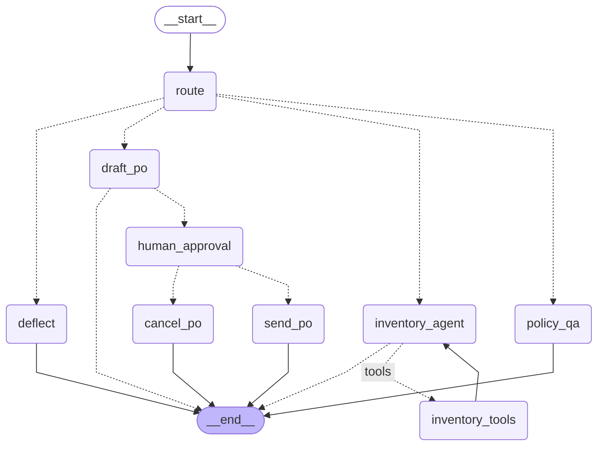

# eighty-six

> The inventory copilot that keeps you from 86'ing the mozzarella.

<!-- hero GIF goes here (Day 5): the PO citing "no weekend delivery" -->

Work in progress — built as a take-home challenge. Sections below get filled in as the
decisions land, not written at the end.

## Quickstart

```
make setup      # python 3.12 venv via uv + deps (torch is big, give it a few minutes)
cp .env.example .env   # then add your ANTHROPIC_API_KEY and LANGSMITH_API_KEY
make seed
make run        # or: make cli
```

## The graph

Generated from the compiled graph with `make graph`, so it can't drift from the code.

<!-- graph:start -->



<!-- graph:end -->

<!-- state write-map table: field / written by / read by (Day 2, hand-written) -->

## Design notes

<!-- tradeoffs table, rows added the day each decision lands -->

| # | Decision | Alternative I rejected | Why |
|---|---|---|---|

## Evals

<!-- 3 datasets, what each measures, results (Day 4) -->

## What I'd improve

<!-- Day 5 -->
