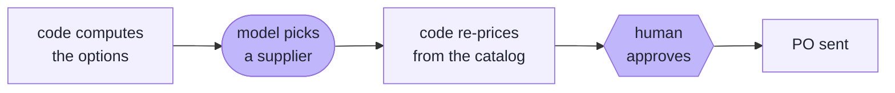
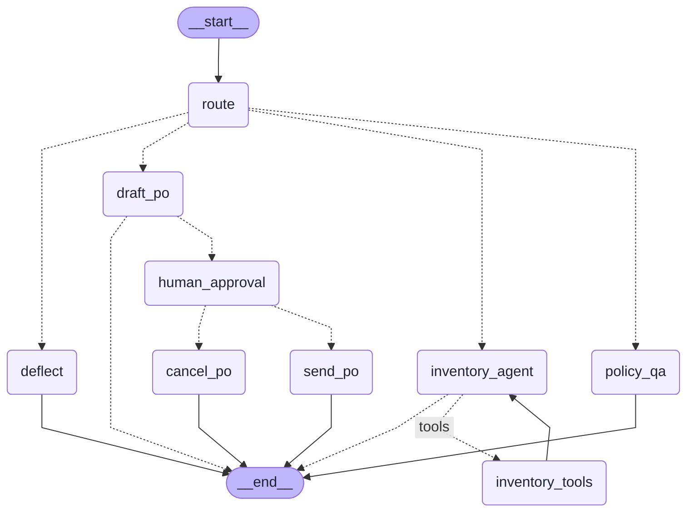

# eighty-six

> The inventory copilot that keeps you from 86'ing the mozzarella.

A LangGraph agent for a small pizzeria (the fictional Sal's Slice House). It
watches stock, answers the owner's questions with real numbers, drafts
purchase orders against supplier terms, and stops for a human before any
money moves.

## What it does

- POS order batches deplete stock through a deterministic pipeline. No model
  touches the math.
- The owner asks questions in plain English: current stock, "can we make 12
  margheritas?", food-safety policy, supplier terms.
- When something runs low, the agent drafts a PO: code computes the options,
  the model picks a supplier using retrieved terms, code re-prices the pick,
  and a LangGraph interrupt holds it until a human clicks approve.



## Quickstart

```
make setup        # python 3.12 venv via uv, installs deps (torch is big)
cp .env.example .env    # add ANTHROPIC_API_KEY + LANGSMITH_API_KEY
make seed         # builds the SQLite db and the Chroma index
make run          # Streamlit UI  (or: make cli)
```

Then, in order:

1. Click **Simulate Friday rush** — the 86 board flips to two flagged items.
2. Ask *"do we have enough fresh mozzarella for the weekend?"*
3. Ask *"draft a reorder for whatever's low"* — and approve it.

After `make seed`, `make test` runs 58 tests with no API keys.

## The graph

Generated from the compiled graph with `make graph`, so it can't drift from
the code.

<!-- graph:start -->



<!-- graph:end -->

`human_approval` is where the graph stops: `interrupt()` checkpoints the
thread mid-run and nothing moves until the interface resumes it with an
approve/reject decision. The pause is invisible in the generated diagram —
it happens inside the node at runtime, not at an edge.

### State

| Field | Written by | Read by |
|---|---|---|
| `messages` | every answering node (append reducer) | everything; the UI streams from it |
| `intent` | `route` | the branch picker |
| `low_stock`, `candidates` | `draft_po` (cleared by `route` each turn) | nothing at runtime — kept so traces show the options the model chose from |
| `po_draft` | `draft_po` (cleared by `route`, `send_po`, `cancel_po`) | approval card, `send_po` |
| `approved` | `human_approval`, from the resume payload | the send/cancel branch |
| `citations` | `policy_qa`, `draft_po` (reset each turn) | the UI's sources list |

## Design notes

| # | Decision | Alternative I rejected | Why |
|---|---|---|---|
| 1 | Owner-facing copilot | A CRUD inventory tracker | Delete the LLM from a tracker and nothing breaks. Here the judgment calls are the product |
| 2 | Order ingestion outside the graph | A graph node for order batches | Nobody chats a JSON file. The graph is a decision surface, not a job runner |
| 3 | Explicit agent + ToolNode loop | `create_react_agent` | ~20 extra lines and the loop shows up in the diagram above |
| 4 | `interrupt()` before `send_po` | Fully autonomous ordering | Money leaves the building. Durable pause/resume is the reason to use LangGraph at all |
| 5 | The approval click is consumed before the resume runs | Resuming inline while the card's buttons are still live | An aborted resume can never replay, so no path double-sends. A lost receipt beats a doubled order |
| 6 | The model never does arithmetic | LLM computes quantities and totals | `price_po()` re-prices every draft from the catalog; model output is a proposal |
| 7 | SQL for live state, RAG for prose | RAG over everything | If it fits in a WHERE clause it doesn't belong in a vector store. Columns win on conflict |
| 8 | Retrieval is a pipeline step in `policy_qa` / `draft_po` | A retrieval tool the agent calls | Grounding shouldn't depend on the model deciding to look, so retrieval runs before the model does |
| 9 | Citations copied from chunk metadata | Parsing cites out of the model's prose | A cite parsed from prose can be invented; the metadata list is just what came back from the store. The eval and both UIs read the same field |
| 10 | Every `retrieve()` call picks its k explicitly | A module-level default k | The library default (4) is the k the lookalike-sections bug lived at. 6 has an eval behind it; 3 is sized to one supplier's terms sheet |
| 11 | Local MiniLM embeddings | A hosted embedding API | You need two API keys to run this, not three |
| 12 | Mostly deterministic evaluators | LLM-as-judge for everything | Exact match where an exact answer exists; the judge only grades prose, and only pass/fail |
| 13 | Datasets are versioned (`routing-v2`, `qa-reorder-v2`), never mutated | Editing the remote dataset in place | Experiments stay comparable across runs, and the 1/5 first run stays visible in the history |
| 14 | Failure branches tested with a fake model at the `chat_model` seam | Stubbing whole nodes, or leaving those branches untested | The retry loop, the router fallback, and the truncation guard are real control flow. The fakes let tests run them without API keys |
| 15 | Redaction before `graph.invoke()` | A redaction node in the graph | Traces and checkpoints record graph inputs verbatim, so an in-graph redactor leaks by design |
| 16 | Haiku router, Opus everywhere else | Opus for routing too | The routing eval scores 8/8 on both models. Same accuracy, ~5x cheaper per route |
| 17 | `InMemorySaver` checkpointer | `SqliteSaver` | One less dependency for a demo. Durable threads are on the improve list |
| 18 | Makefile, no Docker | A Dockerfile | The brief says "or". A multi-GB torch image the reviewer must mount keys into buys nothing over `make setup` |

Three things the evals changed after the fact:

| What the eval caught | The fix |
|---|---|
| The usage tool divided by the 7-day window instead of days-with-data: 9.7 days of mozzarella cover reported, 1.4 true | Divide by days that have sales, and return `data_days` so the model caveats thin history |
| The markdown splitter strips headers, so Roma's "$250 minimum" chunk didn't contain the word Roma — three suppliers embedded as lookalikes | Re-inject the doc title and section into each chunk's text at ingest |
| The supplier tradeoff is calendar-dependent — on a real Sunday the agent picked the "wrong" supplier and was right to | Pin the demo clock (`EIGHTYSIX_DEMO_NOW`). Determinism comes from the world, not the sampler |

## Evals

Four datasets, 32 examples, committed as JSON in `evals/datasets/` and run
with `make eval`. The retrieval set also runs keyless under `make test`, so
a retrieval regression fails the build, not just an experiment.

| Dataset | N | Graded by | Score |
|---|---|---|---|
| `routing-v2` | 8 | exact match on the routed intent, run on Haiku *and* Opus | 8/8 · 8/8 — why the router runs on Haiku |
| `inventory-math-v1` | 3 | exact match against numbers verified by hand before they became the reference | 3/3 |
| `retrieval-v1` | 13 | golden chunk in the top-6 at the production k, pinned to `(source, section)` metadata; rank attached, so a slipping chunk is visible before it misses | 13/13 |
| `qa-reorder-v2` | 8 | judge on answers (pass/fail only), citations vs retrieved metadata, reorder decision vs the paused draft *and* the routed intent — a crashed turn can't grade as a correct decline | 6/6 · 3/3 · 3/3 |

The retrieval queries probe the failure classes this project actually hit:
lookalike section headings across suppliers, paraphrases sharing no
vocabulary with the chunk, the header-stripping regression. The full-graph
set includes one case that runs the agent + tool loop end-to-end, on a stock
number that exists only behind `get_stock`. And the v1 set's first run scored
1/5 on answers — every failure was a real bug; the experiment history in
LangSmith keeps that progression visible on purpose.

## LangSmith

Every run is traced. The `eighty-six-demo` project holds a curated set of
named runs (`make demo`), including the pair that matters: a reorder that pauses at the
approval interrupt, and its resume after approval. Share links live in
[docs/notes.md](docs/notes.md), along with setup detail and the traps we hit.

## What I'd improve

- Demand forecasting: reorders react to a threshold today; even a 7-day
  moving average would let them anticipate the weekend instead.
- Conversation context: the router and retrieval see only the last message,
  so a follow-up like *"and Valco's?"* stands alone. Threading a short
  window through them without breaking the exact-match routing eval is the
  next real design problem.
- Validate the model's `expected_delivery` claim against the KB before it
  reaches the approval card — it's the one model-authored field the human's
  decision actually hinges on.
- A real POS webhook with idempotency keys, replacing batch JSON files.
- Retrieval score thresholds: similarity search always returns k chunks, so
  "nothing relevant" isn't detectable — the honesty case's retrieval goes
  ungraded, and every answer carries six citations however thin the match.
- Multi-supplier orders: one PO per draft right now, so a mixed shortage
  bundles into one vendor or says what it left out.
- A way to ask "what did I already order?" — sent POs are written but nothing
  reads them back yet.
- Durable threads (`SqliteSaver`) so an approval survives a process restart.

## Repo map

```
eightysix/       the package: graph, nodes, state, tools, prompts, db (the
                 SQL), rag, purchasing (all money math), ingest, redaction
app.py / cli.py  two thin interfaces over the same graph
data/seed        the world: ingredients, recipes, suppliers
data/pos_orders  one Friday rush of POS orders
data/kb          five markdown docs the vector store indexes
evals/           datasets as JSON + evaluators + runners
scripts/         seed, ingest, diagram regen, demo curation, day-1 smoke test
docs/            setup notes and the traps we hit
tests/           58 tests, no API keys needed
```
